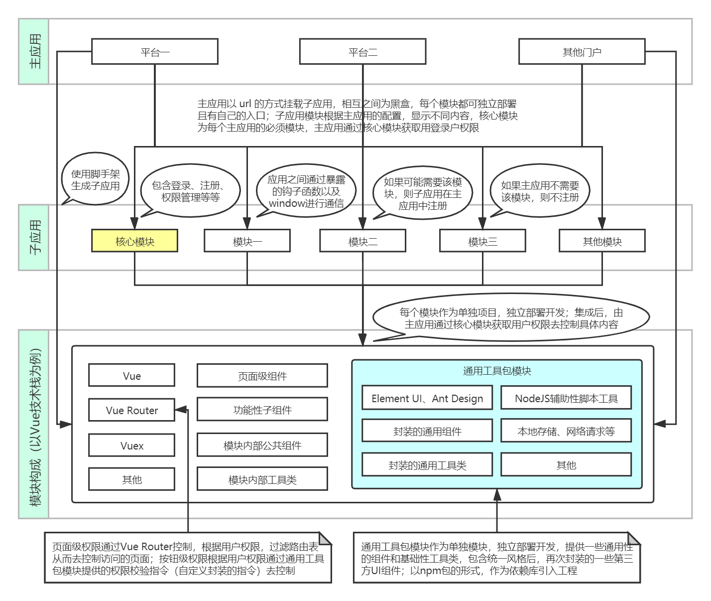

### 整体架构

以平台门户为基础进行划分，每个平台都是一个主应用，主应用必须包含核心模块（也可以叫做基础模块），然后按照平台业务模块进行拆分，拆分出来的每个模块都作为一个独立的子应用，进行独立部署、独立开发以及独立运行。

主应用可以包含任意多的子应用，子应用必须在主应用中注册后才能挂载使用，挂载子应用后，主应用会通过钩子函数把顶级路由以及一些配置信息传递给子应用，子应用根据配置去显示相应的内容。

主应用挂载子应用后，虽然是显示在同一个页面上，但他们是相互隔离的，包括样式隔离、JS 隔离以及资源隔离等，虽然可以共享全局 window 对象，但是每个应用都运行在自己的沙盒中，不会引发冲突。

主应用还可以对子应用预请求资源预加载，在浏览器空闲时间预加载未打开的子应用资源，加速子应用打开速度，提升用户体验。

整体架构如下图所示：

